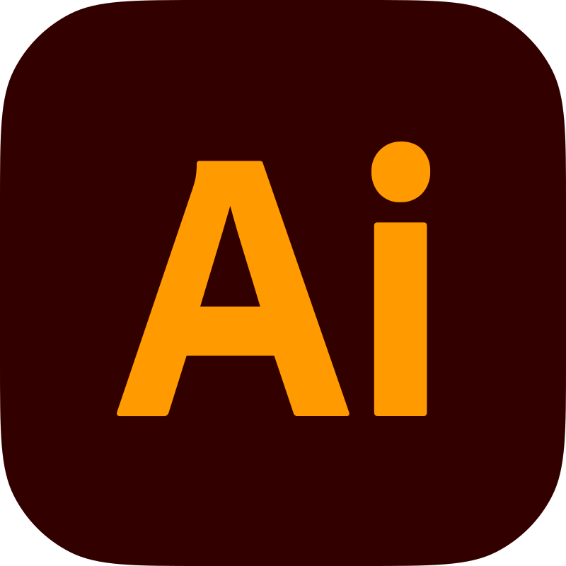
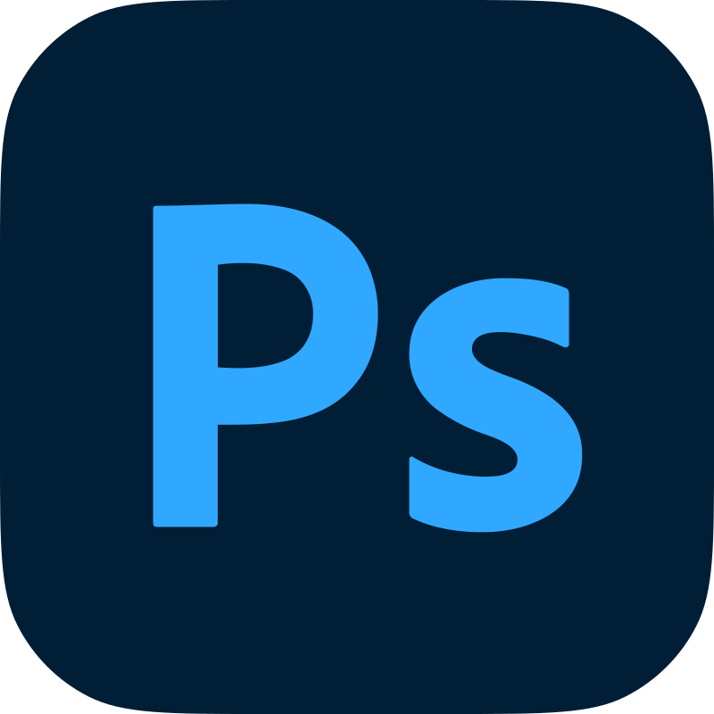

<intro-top>
Hello! I'm Hojoon
</intro-top>
<intro-sub>
I'm a design-centered developer
</intro-sub>
 

I’m a software engineer and a multi-disciplinary media consultant with a passion for exploring and questioning why things are the way they are.

I come from an academic research background at UCLA where I earned my PhD for my dissertation discussing the effect of mixed media to audiences.

## The stuff I use to make stuff and things

### Dev stuff

### Media stuff

