# Hello! I'm Hojoon

## I'm a design-centered developer

I’m a software engineer and a multi-disciplinary media consultant with a passion for exploring and questioning why things are the way they are.

I come from an academic research background at UCLA where I earned my PhD for my dissertation discussing the effect of mixed media to audiences.

## The stuff I use to make stuff and things

#### Languages

#### Frontend

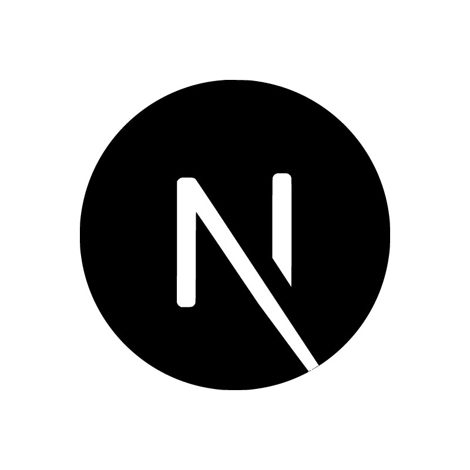

#### Backend

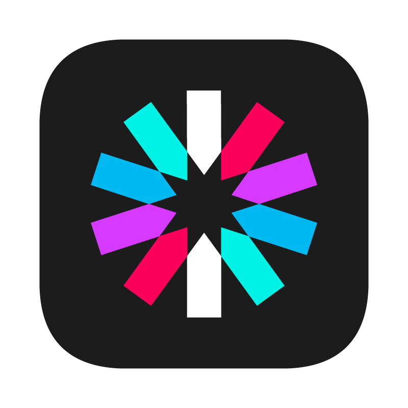

#### Media & Design

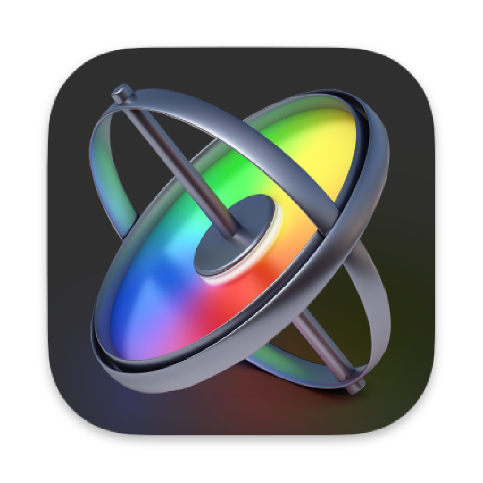
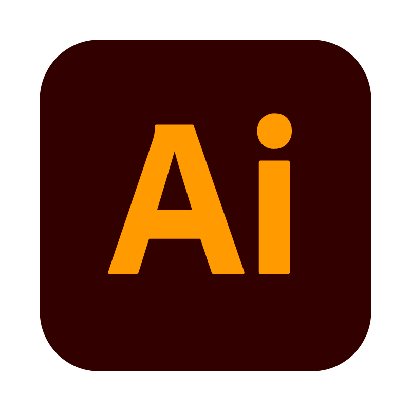

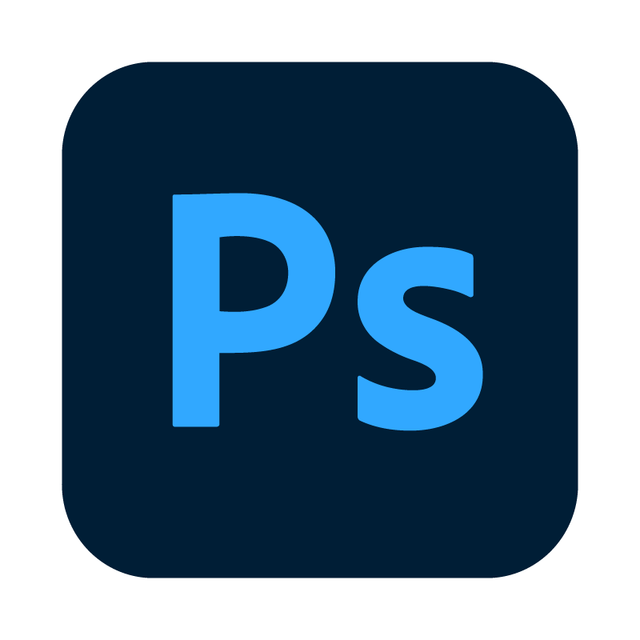
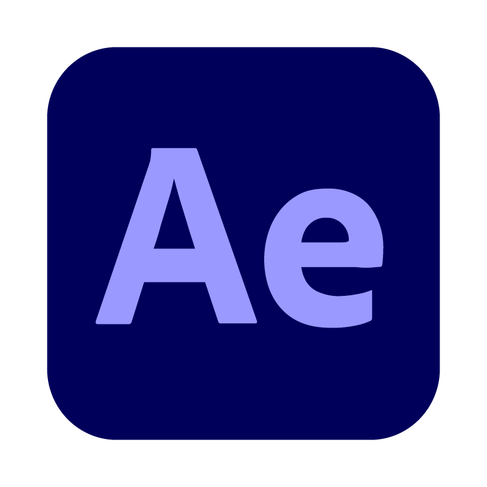
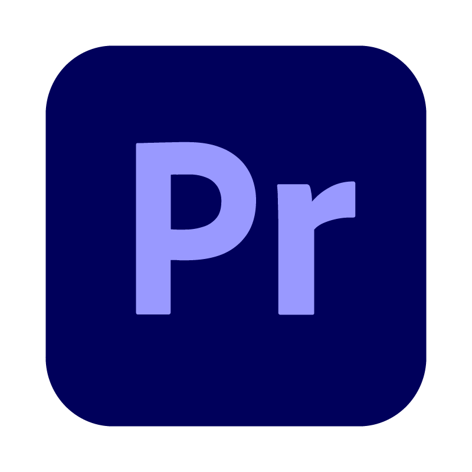

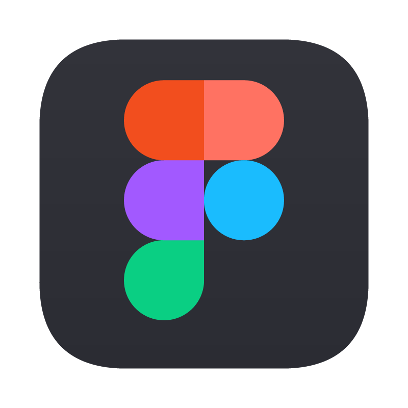

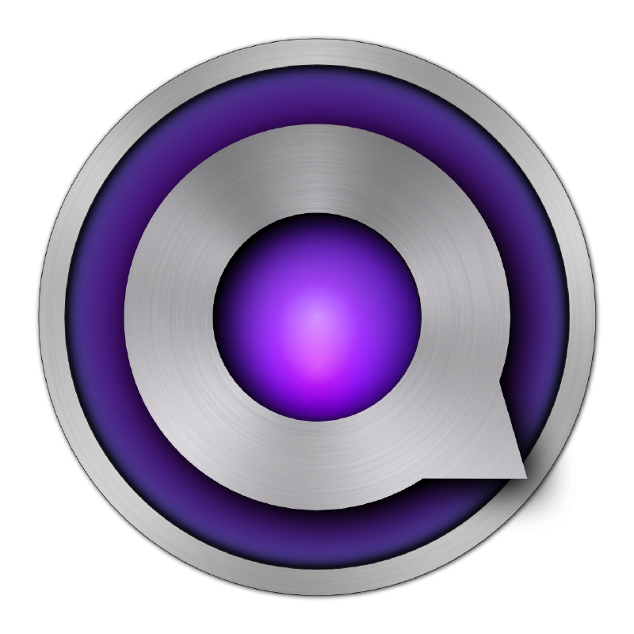

#### Software

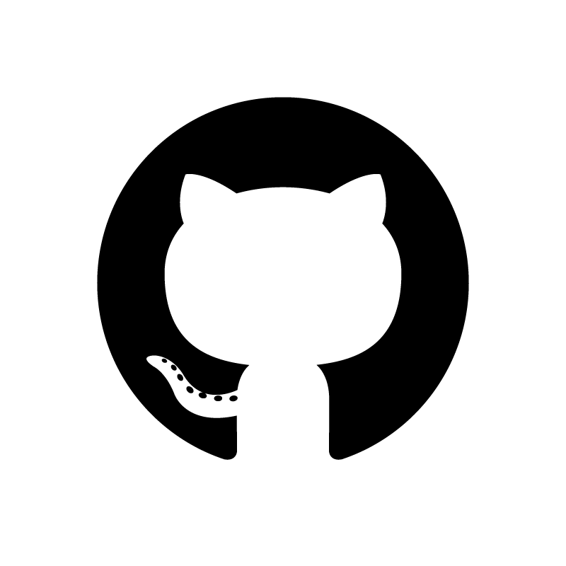
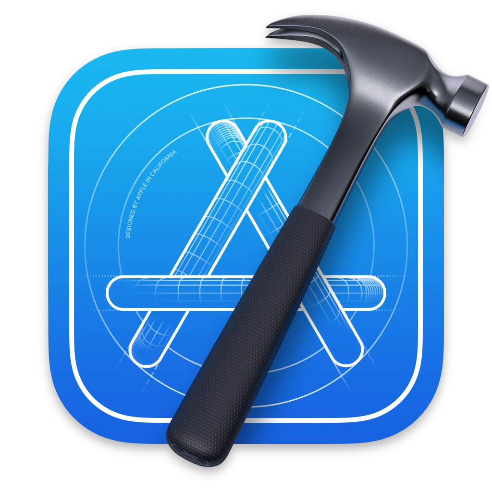

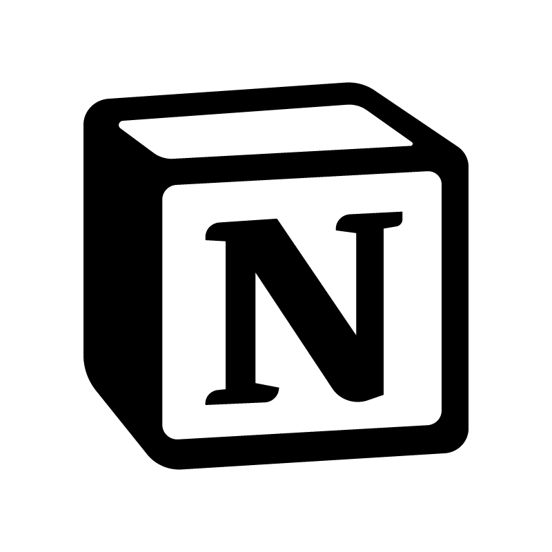
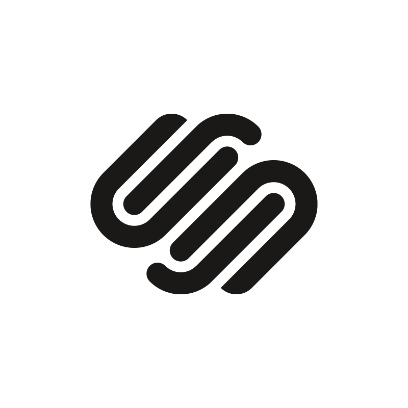

#### Usual Suspects

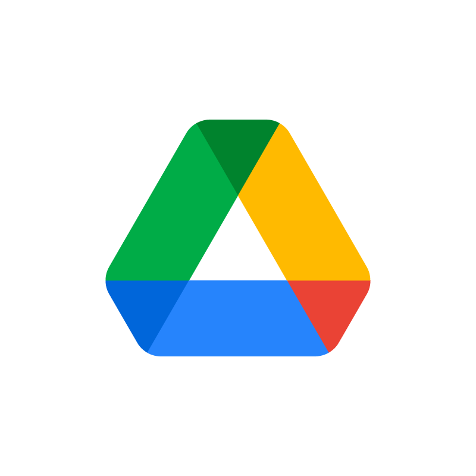

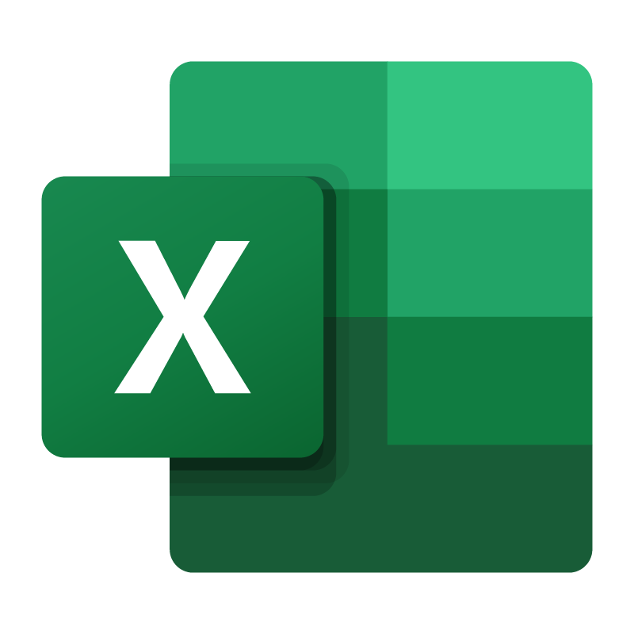

