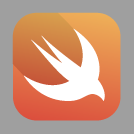
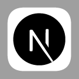
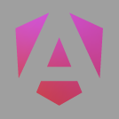
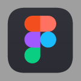
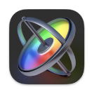
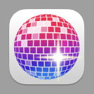
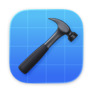

# Hey! I'm Hojoon

## I'm a design-centered dev and I help teams build and launch products with strong design, code, and storytelling.

Currently the Director of Brand and Product at MOindi (Private Alpha), designing/coding the product while shaping brand story and positioning.

Global kid (Seoul → Buenos Aires → LA → NYC → LA again). PhD from UCLA, ex-academic, concert series co-founder, collaborator with Focus Features and the LA Philharmonic.

## The stuff I use to make stuff and things

#### Languages

  
  
  
  

#### Frontend & Web

  
  
  
  
  
  
  
  
  

#### Design

  
  
  
  
  
  

#### Backend

  
  
  
  

#### Database & Content

  
  
  
  
  
  

#### Media

  
  
  
  
  
  
  
  
  

#### Dev Tools

  
  
  
  
  
  
  

#### Usual Suspects

  
  
  
  
  
  
  
  

