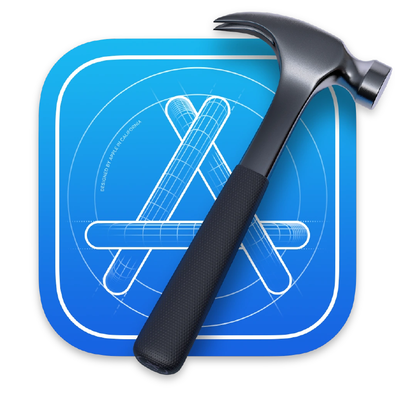

<intro-top style="font-size: 2.5rem; display: block; margin: 0; line-height: 1; font-weight: 100">
Hello! I'm Hojoon
</intro-top>
<intro-sub style="font-size: 1.2rem; display: block; margin-bottom: 1rem; font-weight: 500">
I'm a design-centered developer
</intro-sub>
 

I’m a software engineer and a multi-disciplinary media consultant with a passion for exploring and questioning why things are the way they are.

I come from an academic research background at UCLA where I earned my PhD for my dissertation discussing the effect of mixed media to audiences.

## The stuff I use to make stuff and things

### Dev stuff

### Media stuff

